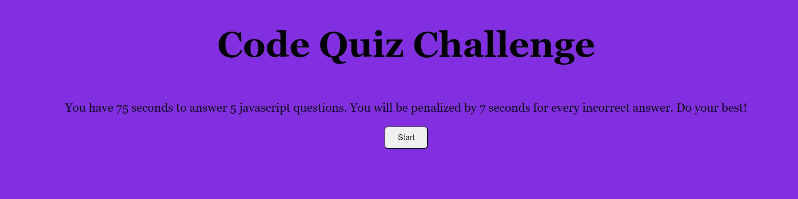
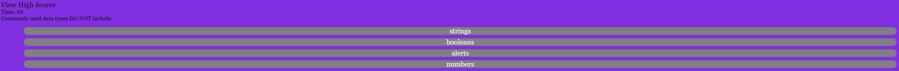
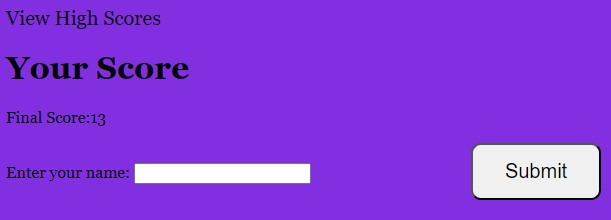
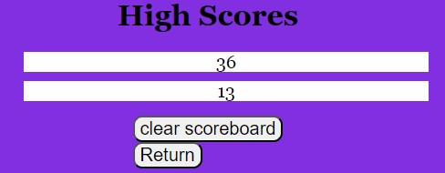

#  codeQuiz

##  Challenge Description

In this challenge I was asked to create a basic page that renders a quiz about coding.

**Acceptance Criteria:**

GIVEN I am taking a code quiz

WHEN I click the start button

THEN a timer starts and I am presented with a question

WHEN I answer a question

THEN I am presented with another question

WHEN I answer a question incorrectly

THEN time is subtracted from the clock

WHEN all questions are answered or the timer reaches 0

THEN the game is over

WHEN the game is over

THEN I can save my initials and my score

**My Link**
https://duck0-land.github.io/codeQuiz/

https://github.com/Duck0-Land/codeQuiz

**Usage Guide**
When entering the page you will be prompted to click the start button to go through the quiz.

Next you will go through a multiple choice quiz about coding.

Then you will enter your name at the end of the quiz.

Finally you will be brought to the scoreboard to see where you rank.

